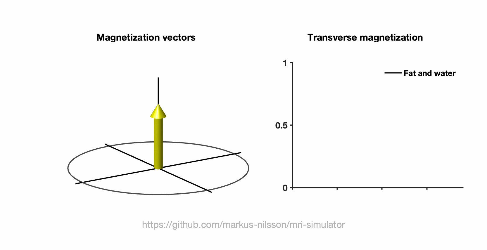

# Imaging fat and water

The resonance frequencies of hydrogen atoms in fat and water are different. As the time passes after the initial RF pulse, the phase of the magnetization vectors associated
with fat and water will evolve differently. At certain times, the magnetization vectors will be in phase and other times out of phase. By acquiring
images both in-phase and out-of-phase, we can differentiate tissues dominated by either fat or water. 

[The code for the illustration can be found here](../code/mridemo_fat_and_water.m)
